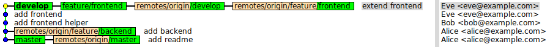
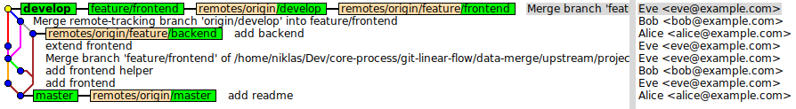

# Git Linear Flow

**Value proposition: a git workflow, ensuring clean and readable linear commit histories everywhere and anytime**

Git commit histories can become messy and intransparent. We propose a git workflow which ensures clean and readable linear commit histories at anytime and any branch.

## Rule #1

**Remember: pull-rebase instead of pull-merge**

Use `git pull --rebase` always. It avoids automatically generated merge commits by replaying your local commits on top of the new tip of the remote branch.

Use `git config --global pull.rebase true` to make it a default. From now on you can continue to use `git pull` as before.

In case you are interested, the command `git pull --rebase` is equivalent to:

```sh
git fetch origin
git rebase --onto origin/<branch> origin/<branch>@{1} <branch>
```

## Rule #2

**Remember: interactive-rebase instead of merge**

Use `git rebase -i <other-branch>` instead of `git merge <other-branch>` to update your current branch. Always use *interactive* (`-i`) rebase!

Make sure the team adheres to rule #1 to avoid unintended side-effects.

Use the safe `git push --force-with-lease` to avoid losing work when you update your remote branch afterward. Do NOT use `git push --force`, as it will not check if somebody else updated the remote branch without you noticing.

## Rule #3

**Remember: fast forward merges only**

Use `git merge --ff-only` instead of `git merge` as a safeguard. Once you follow rule #1 and #2, all merges will be fast-forward merges only. `--ff-only` is a simple shield to ensure you did not break one of the first two rules.

## Your Reward

Check your commit histories by executing `gitk --all`, once you follow these three simple rules. Compare these histories to those of other projects containing implicit merge commits. You will be surprised!

**A clean and readable linear commit history:**



**A messy and confusing commit history (non-linear):**


